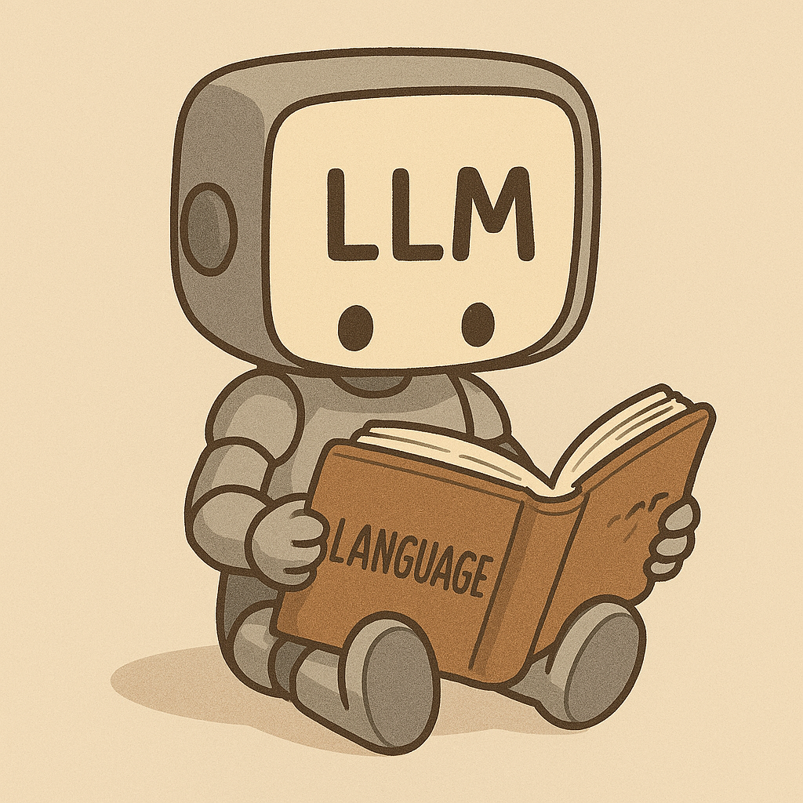
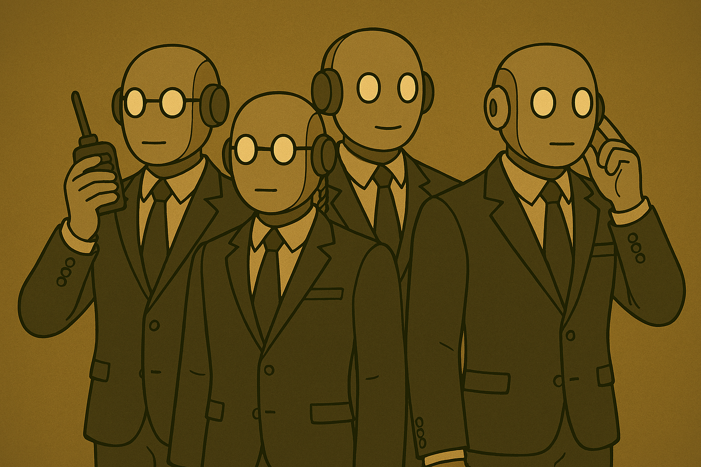
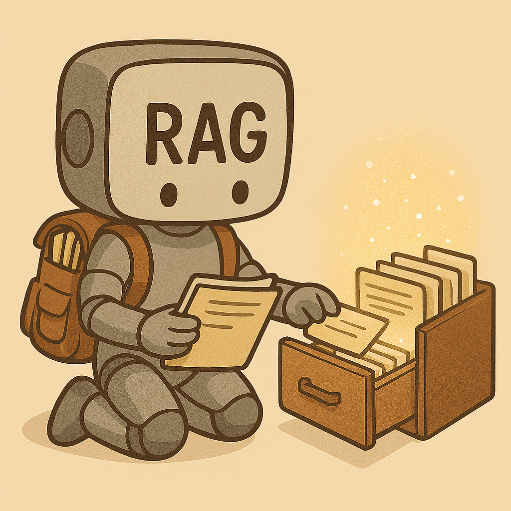

#  Azure AI Foundry Agents

> **Empowering the evolution of intelligent agents with Azure AI, MCP, and modern tool orchestration.**

---

## 🚀 Evolution of AI Agents

      →
   

AI agents have evolved from simple LLMs to powerful, multi-tool orchestrators. This repo demonstrates the journey—step by step—using real code, interactive notebooks, and visual guides.

### Stages of Evolution

| Stage | Description | Visual |
|-------|-------------|--------|
| [1. Just LLM](1-just-llm.ipynb) | Basic language model, no external tools |  |
| [2. RAG](2-rag.ipynb) | Retrieval-Augmented Generation, smarter context |  |
| [3. Tools](3-tools.ipynb) | Tool-calling agents |  |
| [4. Smart Tools](4-better-tools.ipynb) | Improved tool integration |  |
| [5. Foundry Tools](5-foundry-tools.ipynb) | Azure Foundry tool orchestration |  |
| [6. MCP](6-mcp.ipynb) | Model Context Protocol integration |  |
| [7. Connected Agents](7-agent.ipynb) | Multi-agent orchestration and automation |  |

---

## 📚 Interactive Notebooks

Explore each stage with hands-on Jupyter notebooks:

| Notebook | Description | Link |
|----------|-------------|------|
| 1. Just LLM | Basic LLM usage | [1-just-llm.ipynb](1-just-llm.ipynb) |
| 2. RAG | Retrieval-Augmented Generation | [2-rag.ipynb](2-rag.ipynb) |
| 3. Tools | Tool-calling agents | [3-tools.ipynb](3-tools.ipynb) |
| 4. Smart Tools | Improved tool integration | [4-better-tools.ipynb](4-better-tools.ipynb) |
| 5. Foundry Tools | Azure Foundry tool orchestration | [5-foundry-tools.ipynb](5-foundry-tools.ipynb) |
| 6. MCP | Model Context Protocol integration | [6-mcp.ipynb](6-mcp.ipynb) |
| 7. Connected Agents | Multi-agent orchestration and automation | [7-agent.ipynb](7-agent.ipynb) |

---

## 🖼️ Visual Gallery

<table>
	<tr>
		<td align="center">
			 
			<b><a href="1-just-llm.ipynb">Just LLM</a></b>
		</td>
		<td align="center">
			 
			<b><a href="2-rag.ipynb">RAG</a></b>
		</td>
		<td align="center">
			 
			<b><a href="3-tools.ipynb">Tools</a></b>
		</td>
		<td align="center">
			 
			<b><a href="4-better-tools.ipynb">Better Tools</a></b>
		</td>
		<td align="center">
			 
			<b><a href="5-foundry-tools.ipynb">Foundry Tools</a></b>
		</td>
		<td align="center">
			 
			<b><a href="6-mcp.ipynb">MCP</a></b>
		</td>
		<td align="center">
			 
			<b><a href="7-agent.ipynb">Connected Agents</a></b>
		</td>
	</tr>
</table>

---

## 🌐 Key Technologies

- **Azure AI Foundry**: Enterprise-grade agent platform
- **MCP (Model Context Protocol)**: Standardized tool discovery and invocation
- **Semantic Kernel**: Flexible orchestration for LLMs and tools
- **Azure Logic Apps**: Real-world automation
- **Browser Automation**: Web research and blog management

---

## 📝 How to Use

1. Clone the repo
2. Install dependencies (`uv sync`)
3. Create `.env` file based on `.env.example`
4. Open notebooks in VS Code or Jupyter Lab
5. Select kernel from `.venv/bin/python`
4. Follow each notebook to see the evolution in action

### Setup for demo 7

Workbook for multi-agents requires additional steps:
- Foundry has connection to bing grounding
- Foundry has connection to [browser automation](https://learn.microsoft.com/en-us/azure/ai-foundry/agents/how-to/tools/browser-automation#setup)
- Logic App Standard with 4 workflows:
  - create_event, get_events, email_me, get_current_time

---

## 💡 Inspiration

This project is inspired by the rapid evolution of AI agents and the need for open, interoperable standards. All images and code are provided for educational and research purposes.

---

## 📢 Contributing

Pull requests, issues, and feedback are welcome! See [CONTRIBUTING.md](CONTRIBUTING.md) for details.

---

## 📄 License

MIT License. See [LICENSE](LICENSE) for details.

---

> **Made with ❤️ by the Azure AI Foundry community.**
